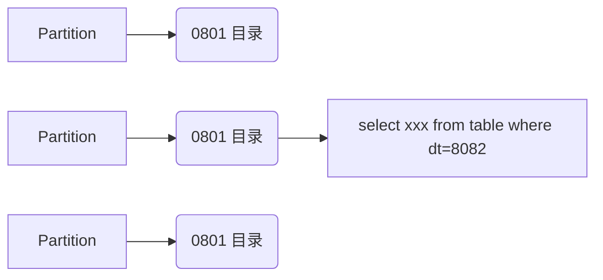

<Boxx changeTime="10000"/>

::: tip 前言
Hive
:::
<!-- more -->

# Hive

1. Hive不是一个计算引擎，它是将SQL语句转成其他计算引擎的执行方式，如Mapreduce和Spark
2. Hive 通过sql的方式进行操作，Hive只是一个吧sql语句转换成mr任务的SQL解析引擎
   1. 实际上在hadoop中，Hbase是分布式数据库
   2. 实际上可以直接用sql操作hbase，就是利用hive实现的
3. Hive中数据表实际上只是一个纯逻辑表，只有表的定义，而没有表的数据。
4. hive中的sql和传统数据库中的sql区别：
	a. hive中的sql不支持改写和删除
	b. hive的sql支持很多的扩展能力，
		i. UDF（用户自定义函数）--1vs1的服务，通常用来做格式化处理，map
		ii. UDAF：用户自定义聚合函数--多vs1的服务，需要与groupby联合使用
		iii. UDTF：用户自定义表生成函数：1对多
	c. 数据检查方式不一样
		i. Hive sql：读时模式
			1) 只有读的时候，才检查数据（类型：字段缺失）
			2) 写的时候，不检查数据。
		ii. 传统SQL：写时模式
			1) 写的时候做检查，为了提升查询的性能
5. Hive的体系架构
   1. 用户接口 client：终端，页面，dashboard
   2. 语句转换：将用户的sql编译转化成Mapreduce进行执行，driver是整个hive的核心
   3. 数据存储：元数据（表的结构定义）的存储和实际数据（HDFS）的存储
      1. 元数据：metastore：不存储在hive中，而是存储在第三方数据库（mysql）中
      2. 默认 derby（不建议用，单用户模式）
      3. 建议MYSQL：多用户模式
        1. 本地
        2. 远程--MYSQL这个集群可以和HDFS完全不影响
6. Hive的数据管理--使用者必须会
   1. Table：内表
      1. 表格的创建和数据的加载，分为2个不同的过程
      2. 可以用一条语句统一的完成
      3. 当删除表格的时候，**数据是一起被删除的，所以工作中建议用外表**
   2. External Table
      1. 删除表格的时候，数据是不删除的
   3. Partition（加快检索速度）
      1. 辅助查询，为了缩小查询范围，加快查询速度
      
      2. 是一个优化手段，不一定所有的数据都加partition。粒度不能太细，建议选择有穷集合，否则创建的partition的文件夹太多

   4. Bucket（不一定会用，知道）设置输出part文件的个数，以及基于part文件怎么进行采样
      1. 控制part分区个数、类似于MR中的task_reduce_num
      2. 采样（数据非常多。采样方式）
      
7. 优化（不一定用）
   8. 控制map和reduce个数
   
   9. Group By，避免产生一个reduce的情况
   
      1. ```
         Select userid,count(*) from table group by userid;---只会产生多个reduce
         ```
         
      2. ```
         Select userid,count(*) from table;---只会产出一个reduce
         ```
   
   
   10. 在做join的时候如果不加on或者无效on， 也会产生一个reduce执行的情况（慢）
   
       ```sql
       Select
       From table A
       Join table B#on 只有Join的时候可这样代替
       where A.userid == B.userid
       ```
   
       
   
   11. Partition 是个非常有效果的优化手段
   
   12. Join，适合大小表关联
   
   13. 大表关联（看一下大表的结构，可以删除掉大量的bot ID）
---
# 2021重新认知
---

第三个优化点：

   慎用distinct，改用**group by**。

   ```sql
   Select count(distinct uid) user_sum from movies
   ```

   **distinct**和**order by** 只启动一个reduce。

   ```
   select count(t1.uid) from (select uid from movies group by uid)t1
   ```

   括号部分就是启用多个reduce来处理一个计算任务。

第四个优化点：小文件，但不用管。小文件越多，map个数也越多，每一个map都会开启一个java虚拟机。


hive 中每个map最大输入大小是256M。

> 为啥选orc和par，优缺点？

ORC 和 Parquet 都是 Hadoop 生态系统中流行的开源列文件存储格式，在效率和速度方面非常相似，最重要的是，它们旨在加快大数据分析工作负载。

`ORC (Optimized Row Columnar)`，是专为 Hadoop 工作负载设计的免费开源列存储格式。

`Parquet` 是 Cloudera 与 Twitter 合作支持的 Hadoop 生态系统中另一种面向开源列的文件格式。

ORC 和 Parquet 都是 Hadoop 生态系统中最流行的两种面向列的文件存储格式，旨在很好地处理数据分析工作负载。
Parquet 由 Cloudera 和 Twitter 共同开发，用于存储具有高列的大型数据集的问题。
ORC 是传统 RCFile 规范的后续产品，存储在 ORC 文件格式中的数据被组织成条带，这些条带高度优化了 HDFS 读取操作。
如果您在 Hadoop 生态系统中使用多种工具，则 Parquet 在适应性方面是一个更好的选择。
Parquet更好地优化了与Spark的使用，而 ORC 则针对Hive进行了优化。但在大多数情况下，两者非常相似，两者之间没有显著差异。

Join优化：


# TF-IDF

文章中有4个词，共10个词：TF-> 4/10=0.4

LDA：主题分析

# 学习网站推荐


1. 刘建平(理论讲的很好):

https://www.cnblogs.com/pinard/

2. lda数学八卦pdf
3. 刘焕勇
4. 模范的

Es框架，搜索，内部很生硬，大厂很少用

