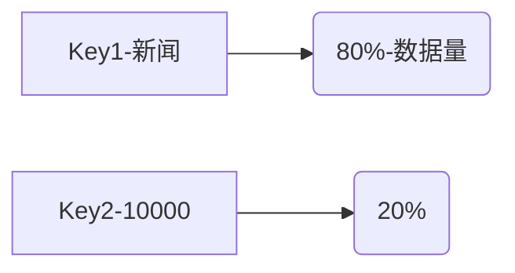

<Boxx changeTime="10000"/>

::: tip 前言
学习的过程中的笔记
:::
<!-- more -->

# 配置环境问题

1. 虚拟机开机pw：12345678？
2. ifconfig
3. 修改ip：

```
cd /etc/sysconfig/network-scripts/

vim ifcfg-eth0   / Centos7:   vim ifcfg-ens33

# ethh0 是当前使用的网卡/ ifcfg-ens33
```
这个是学校的DNS,这里配了2个防止无法使用
```
DNS1=10.10.0.21  
DNS2=114.114.114.114
```


1. 重启网络:

```
/etc/init.d/network restart
```

1. 主节点master在生产过程中，应当多分配一些内存资源。而对于从节点则需要更多的磁盘开销，应当分配更多的磁盘资源。:CentOS 7,复制从节点后，配置ip后需要移除网卡再添加。这个过程会出现新的ifcfg-ens37网卡，但是这个网卡没有配置文件需要用 mv A B 重命名一下。

   补充：一些linux命令

   ```jsx
   1. 使用nmcli con show命令，查看网卡的UUID信息，记下UUID值
   2. 使用ip addr命令查看网卡信息
   3. ifconfig /  ifconfig -a
   ```

   CentOS7修改hostname

   ```bash
   hostnamectl set-hostname master #立即切重启也会生效
   ```

2. 将所用的jave安装文件（bin）格式和hadoop的安装包拷贝到 `/usr/bin/src/`目录下。

```
#cp * /usr/local/src/
```

1. `ll`,查看权限，是否有可执行权限
2. `./xxxx.bin`,安装java
3. 编辑环境变量

```
vim ~/.bashrc
%该文件在/usr/local/src目录下
```

添加：

```
export JAVA_HOME=/usr/local/src/jdk1.6.0_45
export CLASSPATH=.:CLASSPATH:$JAVA_HOME/lib
export PATH=$PATH:$JAVA_HOME/bin
```

然后退出， 终端下输入

```
#source ~/.bashrc
```

1. 查看java的安装位置： `which java`
2. 这时，回到master的/usr/local/src/下，将文件远程复制到slave的/usr/lovcal/src/目录下

```
scp -rp jdk-6u45-linux-x64.bin 192.168.220.129:/usr/local/src/
cat ~/.bashrc
#该语句可以查看bashrc的内部的内容
cat命令是linux下的一个文本输出命令，通常是用于观看某个文件的内容的；
cat主要有三大功能：
1.一次显示整个文件。
$ cat   filename
2.从键盘创建一个文件。
$ cat  >  filename
只能创建新文件,不能编辑已有文件.
3.将几个文件合并为一个文件。
$cat   file1   file2  > file
```

# HIVE

优化的目的：尽量让多台机器去均匀的计算总的数据

1. 如果在一个sql中多次查询一张表，请用from table

2. 慎用count （distinct col），这个尤其是distinct全局去重，只启动一个MR，会造成单个机器压力过大。

3. > 小文件的处理方式。（在工作中不需要过多的关心，有**运维**去处理，可以配置最小核名数据大小，还可以基于orc parquet）
   >
   > orc， seq合并 par合并

4. 过滤 where过滤：谓词下推（提前过滤那些可以早早过滤的数据，减少下一个任务的io）；having；distinct

5. 分区过滤：在读数据的时候，直接去指定的分区里面读数据，where不过mapper进程。select * from table（如果在公用平台上，有的是不符合规的，必须加）

   ```
   select * from table where dt=''
   ```

   甚至有的大厂，不允许select * 这种写法

6. 列过滤，orc parquet 就是这种格式的存储(列存储)会大大减少读取的数据量。直接用schema信息，读取的时候就可以指定读取的列

7. count(col)--不统计空值，它会将col序列化和反序列化，==  count(1) where col is not null,count(*),count(1)

8. 默认开启combiner

9. 大表join小表：启动mapjoin，在工作中自己要去显式的开启mapjoin。聚类里面有个加载聚类中心的代码，就是每个mapper调用setup，spark里面的一个广播。就是把每个小表全部加载到每个mapper的内存中去，然后join发生在map中。


---

## 数据倾斜

不怕数据量大，就怕数据倾斜。

核心点其实就是对应着每个机器干的活不一样多，尤其是1-2个机器干的活太多了。

hash进行分发的，吧key的字段hash到不同的机器上，使得均匀。

如果一个热点新闻（key）里面有大量的数据，分发如果不均匀的话，会全部将这些数据分发到1个reduce上。表现为，99%的reduce完成，一直在刷99%。可能经过很长时间才处理完。




数据倾斜：根本原因：key分布不均。


### **group by 会导致数据倾斜** :

 因为group by会分不同的字段，但这些字段不一定会均匀的分开数据。

> select item, count(*) form tb where dt="group by item, area, age"
>
> 借助其他字段进行key分发 

sum,count等不容易产生数据倾斜。

插一个知识点：group by加盐，join不加盐。如100000个item1，如果改用item+random*1000，那么就可以分成1000个分发到reduce上

### **表join的时候会导致数据倾斜：**join就是把两张表中相同key分发到同一个reduce上

1. MAPJOIN
2. set hive.groupby.skewindata=true   先随机分发
3. 

优化点：尽量保证key不冗余


#### 大表join小表

> 大表join小表之mapjoin这块不是很理解，多看看

#### 大表join大表

必须得过reduce。处理null：

```
select col_a,col_b from a left join b on coalesce(a.key,rand()*9999) on coalesce(b.key,rand()*9999)
```

#### 多表联合join


威尔逊平滑：实现ctr的修正

