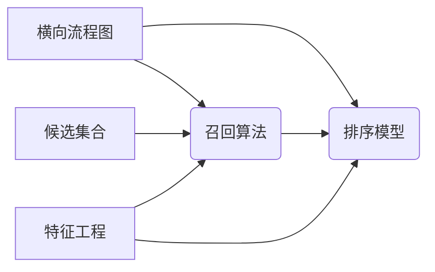
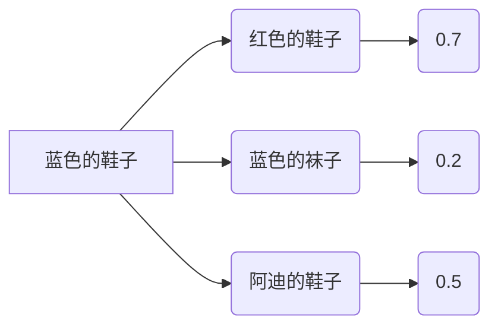

<Boxx changeTime="10000"/>

::: tip 前言
学习札记。
:::
<!-- more -->


# 启用

## hadoop

**去hadoop的sbin下面（因为加入了用户变量，可以直接运行）**

```bash
./start-all.sh
```

查看进程：如果如下，大概是对的

```bash
105765 NameNode
101913 ResourceManager
106201 Jps
105962 SecondaryNameNode
```

## Spark(需要先启动hadoop)

1. 启动：先启动hadoop，再启动spark（sbin下）：master的jps下多了一个Master，slave的jps多了一个Worker

2. 验证：

   1. 本地

      ```bash
      ./bin/run-example SparkPi 10 -master local[2]
      ```

   2. spark的./目录下：集群class模式: http://master:8080/  →spark://master:7077

      ```bash
      #./bin/spark-submit --class org.apache.spark.examples.SparkPi --master spark://master:7077 /usr/local/src/spark-2.4.4-bin-hadoop2.6/examples/jars/spark-examples_2.11-2.4.4.jar 100
      如果是在目录下，可以直接从examples开始
      [root@master **spark-2.4.4-bin-hadoop2.6**]# ./bin/spark-submit --class org.apache.spark.examples.SparkPi --master spark://master:7077 examples/jars/spark-examples_2.11-2.4.4.jar 100
      ```

   3. Yarn模式:http://master:8088/cluster   这个可以不到spark的sbin下单独启用spark服务

      ```bash
      ./bin/spark-submit --class org.apache.spark.examples.SparkPi --master yarn-cluster examples/jars/spark-examples_2.11-2.4.4.jar 10
      ```

3. 拷贝hive的文件到spark

   ```bash
   cp /usr/local/src/apache-hive-1.2.2-bin/conf/hive-site.xml /usr/local/src/spark-2.4.4-bin-hadoop2.6/conf
   
   cp /usr/local/src/apache-hive-1.2.2-bin/lib/mysql-connector-java-5.1.46.jar /usr/local/src/spark-2.4.4-bin-hadoop2.6/jars/
   ```

4. ds

Hadoop存在的主要问题：

1. shuffle过程有大量的io操作
2. Hadoop如果要进行数据处理只有map和reduce原语操作，比较单调。
3. Hadoop中的map task和reduce task都是进程，进程创造的数据都互相独立

## Spark3种模式

### 本地local

local：只启动一个executor
local[k]:启动k个executor
local[*]：启动跟cpu数目相同的 executor


### Standalone

### Yarn

1. yarn-client(driver在本机spark的进程中，kill掉进程，整个任务挂，主要是交互用的，调试程序)
2. yarn-cluster(driver在AM中，kill掉client进程，仍然可以运行。调试程序完，client可以关)-<font color='red'>这个无法在idea提交</font>

Spark 的核心是建立在统一的抽象弹性分布式数据集（Resiliennt Distributed Datasets，RDD）之上的，这使得 Spark 的各个组件可以无缝地进行集成，能够在同一个应用程序中完成大数据处理。

rdd1(x+=1)→rdd2(x+=3)→rdd3

先搭建关系和运算结构，过程中会启动新的rdd，但这个是一个逻辑结构，不存储数据。直到action算子来了，才会触发计算。每个rdd在哪个slave上随机，不知道。

```jsx
rdd_act1.take(10)
这样才拿出数据来
```

RDD默认128M

# Spark


## 回顾：任务运行中的一些基本概念

1. application：聚类任务，程序

2. driver：驱动，管理cluster_task的驱动

3. excutor ：执行任务的最小单位（可以认为是千万台中的一台计算单位，如2core 10gb的容器）

4. worker：集群中可以运行app的节点，即slave节点（计算机）

5. stage: <font color='cornflowerblue'>宽窄依赖，shuffle操作进行分割</font>

6. task:线程，比如同时并行开启3个task

7. job：Transformer 算子 和action算子；要记得<font color='red'>spark是懒加载</font>，不遇到action算子不执行。如果没有action算子，那么他会先编译，而不执行。如下面2个job？

   ```scala
   main()
   val rdd=dt.flatMap(x=>x).reduceBykey(_+_)
   rdd.take(4)
   rdd1.map(x=>(x(1),x(2)+10)).action()
   ```

   懒加载可以节省磁盘IO，如

   ```scala
   dt.map(x=>x).filter(x=>%2==0)
   ```

   spark会首先优化该语句执行的顺序，先执行filter，节省磁盘IO和资源。scala的lazy就是懒加载

8. Spark RDD主要由Dependency、Partition、Partitioner组成，<font color='red'>Partition</font>是其中之一，这是个<font color='orange'>物理概念</font>。一份待处理的原始数据会被按照相应的逻辑(例如jdbc和hdfs的split逻辑)切分成n份，每份数据对应到RDD中的一个Partition，<font color='red'>Partition的数量决定了task的数量，影响着程序的并行度</font>，所以理解Partition是了解spark背后运行原理的第一步。
   

   

   ```mermaid
   graph LR
   A[application_task]-->B[job_T&A algorithm]
   B[job_T&A algorithm]-->F[stage]
   B[job_T&A algorithm]-->E[stage]
   F[stage]-->C(task1)
   F[stage]-->D(task2)
   E[stage]
   E[stage]
   ```
## 怎么调试spark

1. 你的计算机有idea，并且可以远程连接服务器
2. 组织一批数据
3. 现在local模式，调通代码
4. 关掉main方法代码中的local，改成‘yarn-cluster’;尽管其他地方可以调，但是<font color='red'>最高优先级</font>是这个

---

## Transformer一些算子

map():

flatmap()：只是二维降到1维

mappartition():

repartition():

groupByKey():

reducebykey():

<font color='red'>aggregateByKey()</font>：可操作性极强，相当于可以自己定义combiner

1. 对PairRDD中相同的Key值进行聚合操作，在聚合过程中同样使用了一个中立的初始值。和aggregate函数类似，aggregateByKey返回值的类型不需要和RDD中value的类型一致。因为aggregateByKey是对相同Key中的值进行聚合操作，所以aggregateByKey'函数最终返回的类型还是PairRDD，对应的结果是Key和聚合后的值，而aggregate函数直接返回的是非RDD的结果。

2. ```scala
   <span style="font-family:Times New Roman;font-size:18px;">
   import org.apache.spark.SparkConf
   import org.apache.spark.SparkContext
   
   object AggregateByKeyOp {
     def main(args:Array[String]){
        val sparkConf: SparkConf = new SparkConf().setAppName("AggregateByKey").setMaster("local")
       val sc: SparkContext = new SparkContext(sparkConf)
        
        val data=List((1,3),(1,2),(1,4),(2,3))
        val rdd=sc.parallelize(data, 2)
        
        //合并不同partition中的值，a，b得数据类型为zeroValue的数据类型
        def combOp(a:String,b:String):String={
          println("combOp: "+a+"\t"+b)
          a+b
        }
        //合并在同一个partition中的值，a的数据类型为zeroValue的数据类型，b的数据类型为原value的数据类型
         def seqOp(a:String,b:Int):String={
           println("SeqOp:"+a+"\t"+b)
           a+b
         }
         rdd.foreach(println)
         //zeroValue:中立值,定义返回value的类型，并参与运算
         //seqOp:用来在同一个partition中合并值
         //combOp:用来在不同partiton中合并值
         val aggregateByKeyRDD=rdd.aggregateByKey("100")(seqOp, combOp)
         sc.stop()
     }
   }
   </span>
   ```

3. ```shell
   运行结果：
   
   将数据拆分成两个分区
   
   //分区一数据
   (1,3)
   (1,2)
   //分区二数据
   (1,4)
   (2,3)
   
   //分区一相同key的数据进行合并
   seq: 100     3   //(1,3)开始和中立值进行合并  合并结果为 1003
   seq: 1003     2   //(1,2)再次合并 结果为 10032
   
   //分区二相同key的数据进行合并
   seq: 100     4  //(1,4) 开始和中立值进行合并 1004
   seq: 100     3  //(2,3) 开始和中立值进行合并 1003
   
   将两个分区的结果进行合并
   //key为2的，只在一个分区存在，不需要合并 (2,1003)
   (2,1003)
   
   //key为1的, 在两个分区存在，并且数据类型一致，合并
   comb: 10032     1004
   (1,100321004)
   ```

## Action一些算子

1. <font color='red'>aggregate函数</font>:将每个分区里面的元素进行聚合，然后用combine函数将每个分区的结果和初始值(zeroValue)进行combine操作。这个函数最终返回的类型不需要和RDD中元素类型一致。
2. 

## spark的宽窄依赖

RDD是个逻辑分区。partition是个物理概念。

1. 窄依赖是<font color='red'>指父RDD的每个分区只被子RDD的一个分区所使用</font>，子RDD分区通常对应常数个父RDD分区(O(1)，与数据规模无关)   ：使用 :<font color='cornflowerblue'>map、fliter、flatMap</font>

2. 宽依赖是<font color='red'>指父RDD的每个分区都可能被多个子RDD分区所使用</font>，子RDD分区通常对应所有的父RDD分区(O(n)，与数据规模有关):<font color='cornflowerblue'>Collect、join、groupByKey（shuffle）</font>
3. 

1.宽依赖往往对应着shuffle操作(多对一,汇总,多节点)，需要在运行过程中将同一个父RDD的分区传入到不同的子RDD分区中，中间可能涉及多个节点之间的数据传输；而窄依赖的每个父RDD的分区只会传入到一个子RDD分区中，通常可以在一个节点内完成转换。

2.当RDD分区丢失时（某个节点故障），spark会对数据进行重算。

a.  对于窄依赖，由于父RDD的一个分区只对应一个子RDD分区，这样只需要重算和子RDD分区对应的父RDD分区即可，所以这个重算对数据的利用率是100%的；
b.  对于宽依赖，重算的父RDD分区对应多个子RDD分区，这样实际上父RDD 中只有一部分的数据是被用于恢复这个丢失的子RDD分区的，另一部分对应子RDD的其它未丢失分区，这就造成了多余的计算；更一般的，宽依赖中子RDD分区通常来自多个父RDD分区，极端情况下，所有的父RDD分区都要进行重新计算。
c.  如下图所示，b1分区丢失，则需要重新计算a1,a2和a3，这就产生了冗余计算(a1,a2,a3中对应b2的数据)。


**为什么进行宽窄依赖**：宽依赖会导致shuffle，会进行不同分区间的分发，shuffle导致数据落地，数据落地导致磁盘IO，磁盘IO导致计算速度下降，计算速度下降导致性能降低。

---

对多次使用的RDD进行持久化，避免多次进行shuffle的时候出错，需要重复全部计算。

cache()：可以把数据加载内存中，获得数据很快

un.pesist:释放内存

## 在Spark中创建RDD的创建方式

（1）、从集合中创建RDD；（2）、从外部存储创建RDD；（3）、从其他RDD创建。

而从集合中创建RDD，[Spark](https://www.iteblog.com/archives/tag/spark/)主要提供了两中函数：parallelize和makeRDD。


# Flink

## 回顾

# 推荐

## 推荐算法

> 推荐系统：解决信息过载的问题：对信息的反应速度远远大于信息传播的速度（快）；信息量大于受众接受的信息量（大）；大量无关信息（杂）



### 召回：

#### 基于内容的推荐contentbase



（<font color='red'>正排</font>）商家的商品列表：这个过程用<font color='cornflowerblue'>TF-IDF</font>打分

红色的运动鞋--> 分词-->红色/的/运动鞋(S6)

蓝色的跑鞋--><font color='orange'>蓝色</font>（S1）/的/跑鞋(S2)

蓝色的天空--><font color='orange'>蓝色</font>(S3)/的/天空(S4)

蓝色的运动鞋--><font color='orange'>蓝色</font>(S8)/的/运动鞋(S7)


<font color='red'>倒排</font>这个过程累加每个token在各个物品

蓝色(token)-->蓝色的天空(Score2)，蓝色的跑鞋(Score1),蓝色的运动鞋

---

这时用户搜索：蓝色/的/运动鞋--找<font color='red'>倒排表</font>

蓝色-蓝色的天空(S3)、蓝色的跑鞋(S1),蓝色的运动鞋(S8)

运动鞋-红色的运动鞋(S6),蓝色的运动鞋(S7)


那么推荐蓝色的运动鞋的分数:S7+S8

优点：可解释性好；简单易实现

缺点：仅停留在字面，没深层次分析；无个性化


可将用户正在浏览的列表替换为历史浏览记录进行个性化调整。

#### 协同过滤 Collaborative Filtering

1. User-based CF：用户喜欢和他相似用户喜欢的东西


2. Item-based CF： 用户喜欢过去喜欢的物品相似的物品  

#### MF，矩阵分解


#### 模型融合


### **排序**：

#### LR

#### 特征组合

#### 神经网络


## 精排


# 中文分词

## 前缀树


## <font color='orange'>语言模型</font>

### 马尔科夫模型 

### 隐马尔可夫模型

1元，2元（依赖前面的1个状态,即可视范围），3元（依赖前面的2个状态）模型：有限范围内的依赖

# NLP神经网络

## NLP发展史

2001 - Neural language models（神经语言模型）
2008 - Multi-task learning（多任务学习）
2013 - Word embeddings（词嵌入）
2013 - Neural networks for NLP（NLP神经网络）
2014 - <font color='red'>Sequence-to-sequence models</font>
2015 - <font color='red'>Attention（注意力机制）</font>
2015 - Memory-based networks（基于记忆的网络）
2018 - Pretrained language models（预训练语言模型）-Bert,GPT等

## DNN


## CNN

图像领域，当然可用于NLP领域，主要是用于特征的抽取。

## RNN

适合处理时序问题。

用于：<font color='cornflowerblue'>写文章、机器翻译、语音识别、输入法、回归分类、文本相似度（特征抽取）</font>

### RNN vs DNN

RNN隐层之间有相互的联系

### RNN

循环神经网络（RNN）：**隐含层之间的节点不再无连接而是有链接的，并且隐含层的输入不仅包含输入层的输出还包含上一时刻隐含层的输出**。


其中：$x_i$表示为第t,t=1,2,3步的输入;$S_t$是网络的记忆单元。$S_t$根据当前的输入和上一时刻隐含层的输出进行计算，$S_t=f(Ux_t+W_{s_{t-1}})$,其中f一般为非线性的激活函数，如tanh，Relu（后面是LSTM），再计算$S_o$.

$O_t$是t步的输出，$O_t=softmax(Vs_t)$


图中每一步都会有输出，但是每一步都要有输出并不是必须的。比如，我们需要预测一条语句所表达的情绪，我们仅仅需要关系最后一个单词输入后的输出，而不需要知道每个单词输入后的输出。同理，每步都需要输入也不是必须的。**循环神经网络（RNN）的关键之处在于隐含层，隐含层能够捕捉序列的信息。**

## BRNN

**双向循环网络的基本思想是提出每一个训练序列向前和向后分别是两个循环神经网络，而且这两个都连接着一个输出层。**这个结构提供给输出层输入序列中每一个点的完整的过去和未来的上下文信息。下图展示的是一个沿着时间展开的双向循环神经网络。六个独特的权值在每一个时步被重复的利用，六个权值分别对应：输入到向前和向后隐含层（w1, w3），隐含层到隐含层自己（w2, w5），向前和向后隐含层到输出层（w4, w6）。值得注意的是：向前和向后隐含层之间没有信息流，这保证了展开图是非循环的。


Forward pass:

对于BRNN的隐含层，向前推算跟单向的RNN一样，除了输入序列对于两个隐含层是相反方向的，

输出层直到两个隐含层处理完所有的全部输入序列才更新：


Backward pass:

双向循环神经网络（BRNN）的向后推算与标准的循环神经网络（RNN）通过时间反向传播相似，除了所有的输出层δ项首先被计算，然后返回给两个不同方向的隐含层：


## LSTM

为了解决<font color='cornflowerblue'>长序列</font>训练过程中的<font color='red'>梯度消失和梯度爆炸</font>问题。


相比RNN只有一个传递状态 ![[公式]](https://www.zhihu.com/equation?tex=h%5Et+) ，LSTM有两个传输状态，一个 ![[公式]](https://www.zhihu.com/equation?tex=c%5Et) （cell state），和一个 ![[公式]](https://www.zhihu.com/equation?tex=h%5Et) （hidden state）。（Tips：RNN中的 ![[公式]](https://www.zhihu.com/equation?tex=h%5Et) <font color='red'>对于LSTM中的</font> ![[公式]](https://www.zhihu.com/equation?tex=c%5Et) )

首先使用LSTM的当前输入 ![[公式]](https://www.zhihu.com/equation?tex=x%5Et) 和上一个状态传递下来的 ![[公式]](https://www.zhihu.com/equation?tex=h%5E%7Bt-1%7D) 拼接训练得到四个状态。
$$
z=tanh(w\frac{x^t}{h^{t-1}})，这里不是分数\\
z^i=\delta(w^i\frac{x^t}{h^{t-1}})\\
z^f=\delta(w^f\frac{x^t}{h^{t-1}})\\
z^o=\delta(w^o\frac{x^t}{h^{t-1}})
$$
其中， ![[公式]](https://www.zhihu.com/equation?tex=z%5Ef+) ， ![[公式]](https://www.zhihu.com/equation?tex=z%5Ei) ，![[公式]](https://www.zhihu.com/equation?tex=z%5Eo) 是由拼接向量乘以权重矩阵之后，再通过一个 ![[公式]](https://www.zhihu.com/equation?tex=sigmoid+) 激活函数转换成0到1之间的数值，来作为一种门控状态。而 ![[公式]](https://www.zhihu.com/equation?tex=z) 则是将结果通过一个 ![[公式]](https://www.zhihu.com/equation?tex=tanh) 激活函数将转换成-1到1之间的值（这里使用 ![[公式]](https://www.zhihu.com/equation?tex=tanh) 是因为这里是将其做为输入数据，而不是门控信号)。


![[公式]](https://www.zhihu.com/equation?tex=%5Codot) 是哈达玛积(Hadamard Product)，也就是操作矩阵中对应的元素相乘，因此要求两个相乘矩阵是同型的。 ![[公式]](https://www.zhihu.com/equation?tex=%5Coplus) 则代表进行矩阵加法。

LSTM内部主要有三个阶段：

1. 忘记阶段。这个阶段主要是对上一个节点传进来的输入进行**选择性**忘记。简单来说就是会 “忘记不重要的，记住重要的”。具体来说是通过计算得到的 ![[公式]](https://www.zhihu.com/equation?tex=z%5Ef) （f表示forget）来作为忘记门控，来控制上一个状态的 ![[公式]](https://www.zhihu.com/equation?tex=c%5E%7Bt-1%7D) 哪些需要留哪些需要忘。

2. 选择记忆阶段。这个阶段将这个阶段的输入有选择性地进行“记忆”。主要是会对输入 ![[公式]](https://www.zhihu.com/equation?tex=x%5Et) 进行选择记忆。哪些重要则着重记录下来，哪些不重要，则少记一些。当前的输入内容由前面计算得到的 ![[公式]](https://www.zhihu.com/equation?tex=z+) 表示。而选择的门控信号则是由 ![[公式]](https://www.zhihu.com/equation?tex=z%5Ei) （i代表information)来进行控制。

> 将上面两步得到的结果相加，即可得到传输给下一个状态的 ![[公式]](https://www.zhihu.com/equation?tex=c%5Et) 。也就是上图中的第一个公式。

3. 输出阶段。这个阶段将决定哪些将会被当成当前状态的输出。主要是通过 ![[公式]](https://www.zhihu.com/equation?tex=z%5Eo) 来进行控制的。并且还对上一阶段得到的 ![[公式]](https://www.zhihu.com/equation?tex=c%5Eo) 进行了放缩（通过一个tanh激活函数进行变化)。

与普通RNN类似，**输出 ![[公式]](https://www.zhihu.com/equation?tex=y%5Et) 往往最终也是通过 ![[公式]](https://www.zhihu.com/equation?tex=h%5Et) 变化得到**。


## 双向LSTM

**简单来说双向LSTM就是把BRNN中隐含层的小圆圈换成了长短时记忆的模块。**与其说长短时记忆是一种循环神经网络，倒不如说是一个加强版的组件被放在了循环神经网络中。这个模块的样子如下图所示：


遗忘门：
$$
f_t=\sigma(W_f(h_{t-1},x_t)+b_f)
$$
输入门：

$$
i_t=\sigma(W_i\ast[h_{t-1},x_t]+b_i)\\
\hat{C_t}=tanh(W_c\ast[h_{t-1},x_t]+b_c)\\
C_t=f_t\circ C_{t-1}+i_t\circ\hat{C_t}
$$

输出门：

$$
o_t=\sigma(W_o\ast[h_{t-1},x_t]+b_o)\\
h_t=o_t\circ tanh(C_t)
$$


## Transformer

Transformer是Attention is all you need[这篇论文](https://link.zhihu.com/?target=https%3A//arxiv.org/abs/1706.03762)里提出的一个新框架。

RNN不能够并行，训练速度慢；CNN易并行（多个卷积核），但是视野局限。计算复杂度高。

Transformer逐步取代RNN、CNN成为最主流的特征抽取器
<font color='blue'>**RNN的问题**：</font>

- 难以具备并行计算能力

<font color="blue">**CNN的问题**</font>：

- 单层卷积无法捕获远距离特征
- DilatedCNN容易错失重要特征组合---[空洞卷积](https://blog.csdn.net/qq_15111861/article/details/81009636)
- 加深CNN参数设置不方便

### Seq2Seq

Seq2Seq模型，传统的机器翻译基本都是基于Seq2Seq模型来做的，该模型分为encoder层与decoder层，并均为RNN或RNN的变体构成，如下图所示：


在encode阶段，第一个节点输入一个词，之后的节点输入的是下一个词与前一个节点的hidden state，最终encoder会输出一个context，这个context又作为decoder的输入，每经过一个decoder的节点就输出一个翻译后的词，并把decoder的hidden state作为下一层的输入。该模型对于短文本的翻译来说效果很好，但是其也存在一定的缺点，如果文本稍长一些，就很容易丢失文本的一些信息，为了解决这个问题，Attention应运而生。


### attention（一个机制，方法）

attention是一种能让模型对重要信息重点关注并充分学习吸收的技术，**它不算是一个完整的模型**，应当是一种技术，能够作用于任何序列模型中。


Attention，正如其名，注意力，该模型在decode阶段，会选择最适合当前节点的context作为输入。**Attention与传统的Seq2Seq模型主要有以下两点不同。**

1）encoder提供了更多的数据给到decoder，<font color='red'>encoder会把所有的节点的hidden state提供给decoder</font>，而不仅仅只是encoder最后一个节点的hidden state。

2）decoder并不是直接把所有encoder提供的hidden state作为输入，而是<font color='red'>采取一种选择机制，把最符合当前位置的hidden state选出来</font>，具体的步骤如下

- 确定哪一个hidden state与当前节点关系最为密切


- 计算每一个hidden state的分数值（具体怎么计算我们下文讲解）


- 对每个分数值做一个softmax的计算，这能让相关性高的hidden state的分数值更大，相关性低的hidden state的分数值更低

例子：


把每一个encoder节点的hidden states的值与decoder当前节点的上一个节点的hidden state相乘，如上图，h1、h2、h3分别与当前节点的上一节点的hidden state进行相乘(如果是第一个decoder节点，需要随机初始化一个hidden state)，最后会获得三个值，这三个值就是上文提到的hidden state的分数，注意，这个数值对于每一个encoder的节点来说是不一样的，把该分数值进行softmax计算，计算之后的值就是每一个encoder节点的hidden states对于当前节点的权重，把权重与原hidden states相乘并相加，得到的结果即是当前节点的hidden state。可以发现，其实<font color='red'>Atttention的关键就是计算这个分值。</font>

明白每一个节点是怎么获取hidden state之后，接下来就是decoder层的工作原理了，其具体过程如下：

**第一个decoder的节点初始化一个向量，并计算当前节点的hidden state，**把该hidden state作为第一个节点的输入，经过RNN节点后得到一个新的hidden state与输出值。注意，这里和Seq2Seq有一个很大的区别，Seq2Seq是直接把输出值作为当前节点的输出，但是Attention会把该值与hidden state做一个连接，并把连接好的值作为context，并送入一个前馈神经网络，最终当前节点的输出内容由该网络决定，重复以上步骤，直到所有decoder的节点都输出相应内容。


Attention模型并不只是盲目地将输出的第一个单词与输入的第一个词对齐。实际上，它在训练阶段学习了如何在该语言对中对齐单词(示例中是法语和英语)。Attention函数的本质可以被描述为一个查询（query）到一系列（键key-值value）对的映射。


在计算attention时主要分为三步，第一步是将query和每个key进行相似度计算得到权重，常用的相似度函数有<font color='red'>点积，拼接，感知机等</font>；然后第二步一般是使用一个softmax函数对这些权重进行归一化；最后将权重和相应的键值value进行加权求和得到最后的attention。目前在NLP研究中，**key和value常常都是同一个，即key=value**。<font color='red'>当Query=key=value时就是self-attention</font>。


比如上面这个图：key 通过第一阶段的到了分数s1-s4；然后通过归一化softmax得到了a1-a4；然后求$ \sum a_1 \ast Value1$...

得到attention。

Attention本质是一种对齐的方法。 

### **Self Attention模型**

#### 拓展阅读

https://blog.csdn.net/tmb8z9vdm66wh68vx1/article/details/106030130

https://daiwk.github.io/posts/nlp-self-attention-models.html#self-attention

https://daiwk.github.io/posts/nlp-self-attention-models.html#self-attention


通过上述对Attention本质思想的梳理，我们可以更容易理解本节介绍的Self Attention模型。Self Attention也经常被称为intra Attention（内部Attention），最近一年也获得了比较广泛的使用，比如Google最新的机器翻译模型内部大量采用了Self Attention模型。

在一般任务的Encoder-Decoder框架中，输入Source和输出Target内容是不一样的，比如对于英-中机器翻译来说，Source是英文句子，Target是对应的翻译出的中文句子，Attention机制发生在Target的元素Query和Source中的所有元素之间。**而Self Attention顾名思义，指的不是Target和Source之间的Attention机制，而是Source内部元素之间或者Target内部元素之间发生的Attention机制，也可以理解为Target（<font color='red'>Query</font>）=Source（<font color='red'>Key</font>）这种特殊情况下的注意力计算机制**。其具体计算过程是一样的，只是计算对象发生了变化而已，所以此处不再赘述其计算过程细节。

如果是常规的Target不等于Source情形下的注意力计算，其物理含义正如上文所讲，比如对于机器翻译来说，本质上是目标语单词和源语单词之间的一种单词对齐机制。那么如果是Self Attention机制，一个很自然的问题是：通过Self Attention到底学到了哪些规律或者抽取出了哪些特征呢？或者说引入Self Attention有什么增益或者好处呢？我们仍然以机器翻译中的Self Attention来说明，图11和图12是可视化地表示Self Attention在同一个英语句子内单词间产生的联系。


> 引入Self Attention后会更容易捕获句子中长距离的相互依赖的特征，因为如果是RNN或者LSTM，需要依次序序列计算，对于远距离的相互依赖的特征，要经过若干时间步步骤的信息累积才能将两者联系起来，而距离越远，有效捕获的可能性越小。
>
> 但是Self Attention在计算过程中会直接将句子中任意两个单词的联系通过一个计算步骤直接联系起来，所以远距离依赖特征之间的距离被极大缩短，有利于有效地利用这些特征。除此外，Self Attention对于增加计算的并行性也有直接帮助作用。这是为何Self Attention逐渐被广泛使用的主要原因。

### Transformer(是一个模型，RNN，LSTM)

和Attention一样，Transformer模型中也采用了 encoer-decoder 架构。但其结构相比于Attention更加复杂，论文中encoder层由6个encoder堆叠在一起，decoder层也一样。


每一个encoder和decoder的内部简版结构如下图


对于encoder，包含两层，一个self-attention层和一个前馈神经网络，self-attention能帮助当前节点不仅仅只关注当前的词，从而能获取到上下文的语义。**decoder也包含encoder提到的两层网络，但是在这两层中间还有一层attention层，帮助当前节点获取到当前需要关注的重点内容。**

现在我们知道了模型的主要组件，接下来我们看下模型的内部细节。首先，模型需要对输入的数据进行一个embedding操作，（也可以理解为类似w2v的操作），enmbedding结束之后，输入到encoder层，self-attention处理完数据后把数据送给前馈神经网络，前馈神经网络的计算可以并行，得到的输出会输入到下一个encoder。


#### **Self-Attention**(再说一下)

接下来我们详细看一下self-attention，其思想和attention类似，但是self-attention是Transformer用来<font color='red'>将其他相关单词的“理解”转换成我们正常理解的单词的一种思路</font>，我们看个例子：
The animal didn't cross the street because it was too tired
这里的it到底代表的是animal还是street呢，对于我们来说能很简单的判断出来，但是对于机器来说，是很难判断的，self-attention就能够让机器把it和animal联系起来


接下来我们看下详细的处理过程。

1、首先，self-attention会计算出三个新的向量，在论文中，向量的维度是512维，我们把这三个向量分别称为Query、Key、Value，这三个向量是用embedding向量与一个矩阵相乘得到的结果，这个矩阵是随机初始化的，维度为（<font color='red'>64，512</font>）注意第二个维度需要和embedding的维度一样，其值在BP的过程中会一直进行更新，得到的这三个向量的维度是64低于embedding维度的。

> 解读：
>
> 1. 这里有2个单词，首先将他们表示为2个向量（Embedding）<font color='red'>key=value</font>
> 2. 分别初始化一些独立的向量Q，K，V-->得到后面的权重矩阵$W^Q,W^K,W^V $,这些都是模型自己学习出来的


$\sum$<font color='cornflowerblue'>Softmax(Query*Key)</font> *Value

2、计算self-attention的分数值，该分数值决定了当我们在某个位置encode一个词时，对输入句子的其他部分的关注程度。这个分数值的计算方法是Query与Key做点乘，以下图为例，首先我们需要针对Thinking这个词，计算出其他词对于该词的一个分数值，首先是针对于自己本身即q1·k1，然后是针对于第二个词即q1·k2


3、接下来，把点成的结果除以一个常数，这里我们除以8，这个值一般是采用上文提到的矩阵的<font color='red'>第一个维度（第一步）的开方</font>即64的开方8，当然也可以选择其他的值，然后把得到的结果做一个softmax的计算。得到的结果即是每个词对于当前位置的词的相关性大小，当然，当前位置的词相关性肯定会会很大


4、下一步就是把Value和softmax得到的值进行相乘，并相加，<font color='red'>得到的结果即是self-attetion在当前节点的值Z1。</font>

> Z1=0.88*V1+0.12*V2


***实现并行***

**在实际的应用场景，为了提高计算速度，我们一下计算多个句子，采用的是矩阵的方式，直接计算出Query, Key, Value的矩阵，然后把embedding的值与三个矩阵直接相乘，把得到的新矩阵Q与K相乘，乘以一个常数，做softmax操作，最后乘上V矩阵**，特别是GPU特别适合这样的操作


这种通过 query 和 key 的相似性程度来确定 value 的权重分布的方法被称为scaled dot-product attention。其实scaled dot-Product attention就是我们常用的使用点积进行相似度计算的attention，只是**多除了一个（为K的维度）**起到调节作用，使得内积不至于太大。


---

另一种方式理解


为什么叫self呢，是因为是在<font color='red'>*同一句中找相关的单词*</font>。

#### Multi-Headed Attention

这篇论文更厉害的地方是给self-attention加入了另外一个机制，被称为“multi-headed” attention，该机制理解起来很简单，就是说不**仅仅只初始化一组Q、K、V的矩阵**，而是**初始化多组**，tranformer是使用了8组，所以最后得到的结果是8个矩阵。**这里的head类似于CNN里面的卷积核。**


这给我们留下了一个小的挑战，前馈神经网络没法输入8个矩阵呀，这该怎么办呢？所以我们需要一种方式，把8个矩阵降为1个，首先，我们把8个矩阵连在一起，这样会得到一个大的矩阵，再随机初始化一个矩阵和这个组合好的矩阵相乘，最后得到一个最终的矩阵。


这就是multi-headed attention的全部流程了，这里其实已经有很多矩阵了，我们把所有的矩阵放到一张图内看一下总体的流程。可以进行**GPU**加速。


多头attention（Multi-head attention）整个过程可以简述为：Query，Key，Value首先进过一个线性变换，然后输入到放缩点积attention（注意这里要做**<font color="red">h</font>**次，其实也就是所谓的多头，每一次算一个头，而且每次Q，K，V进行线性变换的参数W是不一样的），然后将h次的放缩点积attention结果<font color="red">进行拼接</font>，再进行一次线性变换得到的值作为多头attention的结果。可以看到，**google提出来的多头attention的不同之处在于进行了h次计算而不仅仅算一次**，论文中说到这样的好处是可以允许模型在不同的表示子空间里学习到相关的信息，后面还会根据attention可视化来验证。


那么在整个模型中，是如何使用attention的呢？如下图，首先在编码器到解码器的地方使用了多头attention进行连接，K，V，Q分别是编码器的层输出（这里K=V）和解码器中都头attention的输入。其实就和主流的机器翻译模型中的attention一样，利用解码器和编码器attention来进行翻译对齐。然后在编码器和解码器中都使用了多头自注意力self-attention来学习文本的表示。<font color='red'>Self-attention即K=V=Q</font>，例如**输入一个句子，那么里面的每个词都要和该句子中的所有词进行attention计算。目的是学习句子内部的词依赖关系，捕获句子的内部结构。**


使用self-attention的原因：

- 每一层的复杂度：

  - 如果输入序列n小于表示维度d的话，每一层的时间复杂度Self-Attention是比较有优势的。
  - 当n比较大时，作者也给出了一种解决方案Self-Attention(restricted)即每个词不是和所有词计算Attention，而是只与限制的r个词去计算Attention。

- 是否可以并行: multi-head Attention和CNN一样不依赖于前一时刻的计算，可以很好的并行，优于 RNN。

- 长距离依赖: 由于Self-Attention是每个词和所有词都要计算Attention，所以不管他们中间有多长距离，最大的路径长度也都只是 1。可以捕获长距离依赖关系。

  

现在我们已经接触了attention的header，让我们重新审视我们之前的例子，看看例句中的“it”这个单词在不同的attention header情况下会有怎样不同的关注点（这里不同颜色代表attention不同头的结果，颜色越深attention值越大）。


当我们对“it”这个词进行编码时，一个注意力的焦点主要集中在“animal”上，而另一个注意力集中在“tired”（两个heads）
但是，如果我们将所有注意力添加到图片中，可能有点难理解：


#### Positional Encoding

##### 相似度任务

输入两个两个字符串之间的关系。

>我今天很开心
>
>开心的不要不要的

步骤：

1. 分词

   >我/今天/很/开心
   >
   >开心/的/不要/不要/的

2. 拼接成一个句子,CLS和SPE是自己打上的特殊标记，CLS表示开头，SPE表示分割或者结尾

   ```mermaid
   graph LR
   A[CLS]-->B[我 今天 很 开心]-->C[SEP]-->D[开心 的 不要 不要 的]-->E[SEP]
   
   ```
   
   判断这个句子是1还是0，是1相关
   
3. 将每个单词变为embedding（查字典，直接插embedding的dic，开始是堆积初始化，但是随着学习，会变为固定的vector的，每个单词是不一样的），e是embedding

   ```mermaid
   graph LR
   A[CLS]-->B[我 今天 很 开心]-->C[SEP]-->D[开心 的 不要 不要 的]-->E[SEP]
   A1[CLS]-->B1[e ee e ee]-->C1[SEP]-->D1[ee e ee ee e]-->E1[SEP]
   ```

   

4. 然后再加一个标签，明确的表示那个句子是前面的，那个句子是后面的。这四行分别是---<font color='red'>句子、 word embedding,  Segment embedding,  position embedding</font>

   ```mermaid
   graph LR
   A[CLS]-->B[我 今天 很 开心]-->C[SEP]-->D[开心 的 不要 不要 的]-->E[SEP]
   A1[CLS]-->B1[e ee e ee]-->C1[SEP]-->D1[ee e ee ee e]-->E1[SEP]
   A2[1]-->B2[1 11 1 11]-->C2[2]-->D2[11 1 11 11 1]-->E2[2]
   A3[1]-->B3[2 3 4 5]-->C3[6]-->D3[7 8 9 10 11]-->E3[12]
   ```

5. 这时候有了3个向量：embedding，句子位置vector，每个单词的位置vector

6. 将这3个向量加起来，叫做input embedding，如下图

   ```mermaid
   graph LR
   A[v]-->B[v v v v]-->C[v]-->D[v v v v v]-->E[SEP]
   
   ```
   
7. 将input embedding传给**Bert**。bert会返回是1还是0.

##### position encoding

到目前为止，transformer模型中还缺少一种**解释输入序列中单词顺序**的方法。为了处理这个问题，transformer给encoder层和decoder层的输入添加了一个额外的向量Positional Encoding，维度和embedding的维度一样，这个向量采用了一种很独特的方法来让模型学习到这个值，这个向量能决定当前词的位置，或者说在一个句子中不同的词之间的距离。这个位置向量的具体计算方法有很多种，论文中的计算方法如下
$$
PE=(pos,2i)=sin(pos/10000^{2i}/d_model)\\
PE=(pos,2i+1)=cos(pos/10000^{2i}/d_model)
$$


其中pos是指当前词在句子中的位置，i是指向量中每个值的index，可以看出，在偶数位置，使用正弦编码，在奇数位置，使用余弦编码。最后把这个Positional Encoding与embedding的值相加，作为输入送到下一层。


为了让模型捕捉到单词的顺序信息，我们添加位置编码向量信息（POSITIONAL ENCODING），位置编码向量不需要训练，它有一个规则的产生方式（上图公式）。

如果我们的嵌入维度为4，那么实际上的位置编码就如下图所示：


那么生成位置向量需要遵循怎样的规则呢？

观察下面的图形，每一行都代表着对一个矢量的位置编码。因此第一行就是我们输入序列中第一个字的嵌入向量，每行都包含512个值，每个值介于1和-1之间。我们用颜色来表示1，-1之间的值，这样方便可视化的方式表现出来：


这是一个20个字（行）的（512）列位置编码示例。你会发现它咋中心位置被分为了2半，这是因为左半部分的值是一由一个正弦函数生成的，而右半部分是由另一个函数（余弦）生成。然后将它们连接起来形成每个位置编码矢量。

##### Layer normalization
在transformer中，每一个子层（self-attetion，ffnn）之后都会接一个残差模块，并且有一个Layer normalization

> Feed Forward: FC全连接线性变换
>
> shot-cut:解决深度学习中的退化问题 


在进一步探索其内部计算方式，我们可以将上面图层可视化为下图：


残差模块相信大家都很清楚了，这里不再讲解，主要讲解下Layer normalization。Normalization有很多种，但是它们都有一个共同的目的，那就是把输入转化成均值为0方差为1的数据。我们在把数据送入激活函数之前进行normalization（归一化），因为我们不希望输入数据落在激活函数的饱和区。

说到 normalization，那就肯定得提到 Batch Normalization。BN的主要思想就是：在每一层的每一批数据上进行归一化。我们可能会对输入数据进行归一化，但是经过该网络层的作用后，我们的数据已经不再是归一化的了。随着这种情况的发展，数据的偏差越来越大，我的反向传播需要考虑到这些大的偏差，这就迫使我们只能使用较小的学习率来防止梯度消失或者梯度爆炸。

BN的具体做法就是对每一小批数据，在批这个方向上做归一化。如下图所示：


可以看到，右半边求均值是沿着数据 batch_size的方向进行的，其计算公式如下：


那么什么是 Layer normalization 呢？它也是归一化数据的一种方式，不过 LN 是在**每一个样本上计算均值和方差**，而不是BN那种在批方向计算均值和方差！

<font color='red'>BN适合固定深度的网络，而LN则适合变长深度的网络；LN用于RNN比较好，而BN用于CNN比较好</font>


下面看一下 LN 的公式：


到这里为止就是全部encoders的内容了，如果把两个encoders叠加在一起就是这样的结构，在self-attention需要强调的最后一点是其采用了残差网络中的short-cut结构，目的是解决深度学习中的退化问题。


##### Decoder层


上图是transformer的一个详细结构，相比本文一开始结束的结构图会更详细些，接下来，我们会按照这个结构图讲解下decoder部分。

可以看到decoder部分其实和encoder部分大同小异，不过在最下面额外多了一个masked mutil-head attetion，这里的mask也是transformer一个很关键的技术，我们一起来看一下。

##### Mask
mask 表示掩码，它对某些值进行掩盖，使其在参数更新时不产生效果。Transformer 模型里面涉及两种 mask，分别是 padding mask 和 sequence mask。

<font color='red'>**其中，padding mask 在所有的 scaled dot-product attention 里面都需要用到，而 sequence mask 只有在 decoder 的 self-attention 里面用到。**</font>

##### Padding Mask
什么是 padding mask 呢？因为**每个批次输入序列长度是不一样的**也就是说，我们要对输入序列进行对齐。具体来说，就是给在较短的序列后面填充 0。但是如果输入的序列太长，则是截取左边的内容，把多余的直接舍弃。因为这些填充的位置，其实是没什么意义的，所以我们的attention机制不应该把注意力放在这些位置上，所以我们需要进行一些处理。

具体的做法是，把这些位置的值加上一个非常大的负数(负无穷)，这样的话，经过 softmax，这些位置的概率就会接近0！

而我们的 padding mask 实际上是一个张量，每个值都是一个Boolean，值为 false 的地方就是我们要进行处理的地方。

##### Sequence mask
文章前面也提到，sequence mask 是为了使得 decoder 不能看见未来的信息。也就是对于一个序列，在 time_step 为 t 的时刻，我们的解码输出应该只能依赖于 t 时刻之前的输出，而不能依赖 t 之后的输出。因此我们需要想一个办法，把 t 之后的信息给隐藏起来。

那么具体怎么做呢？也很简单：产生一个上三角矩阵，上三角的值全为0。把这个矩阵作用在每一个序列上，就可以达到我们的目的。

对于 decoder 的 self-attention，里面使用到的 scaled dot-product attention，同时需要padding mask 和 sequence mask 作为 attn_mask，具体实现就是两个mask相加作为attn_mask。
其他情况，attn_mask 一律等于 padding mask。

---

编码器通过处理输入序列启动。然后将顶部编码器的输出转换为一组注意向量k和v。每个解码器将在其“encoder-decoder attention”层中使用这些注意向量，这有助于解码器将注意力集中在输入序列中的适当位置：


完成编码阶段后，我们开始解码阶段。解码阶段的每个步骤从输出序列（本例中为英语翻译句）输出一个元素。
以下步骤重复此过程，一直到达到表示解码器已完成输出的符号。每一步的输出在下一个时间步被送入底部解码器，解码器像就像我们对编码器输入所做操作那样，我们将**位置编码**嵌入并添加到这些解码器输入中，以表示每个字的位置。


##### 输出层
当decoder层全部执行完毕后，怎么把得到的向量映射为我们需要的词呢，很简单，只需要在结尾再添加一个全连接层和softmax层，假如我们的词典是1w个词，那最终softmax会输入1w个词的概率，概率值最大的对应的词就是我们最终的结果。


##### 总结

1. Self attention
2. Multi-Head
3. 多册堆叠（embedding+position embedding=Input embedding），位置编码
4. 并行加速训练

## Bert （**BERT就是从transformer中衍生出来的预训练语言模型**）

bert有一个结构 Transformer：类似长江后浪推前浪，是改进了的RNN

RNN缺点：

1. 串行的状态，不能乱，必须依次执行，导致了训练速度慢

2. RNN长期记忆能力有限。不能记忆很久之前的信息，所以使用LSTM，但是LSTM不是万能的，最近的消息权重较大

Bert就是基于Transformer构建的，这个模型广泛应用于NLP领域，例如机器翻译，问答系统，文本摘要和语音识别等等方向。

---

> GPT是“Generative Pre-Training”的简称，是指的生成式的预训练。

从创新的角度来看，bert其实并没有过多的结构方面的创新点，其和GPT一样均是采用的transformer的结构，相对于GPT来说，其是双向结构的，而GPT是单向的，如下图所示


